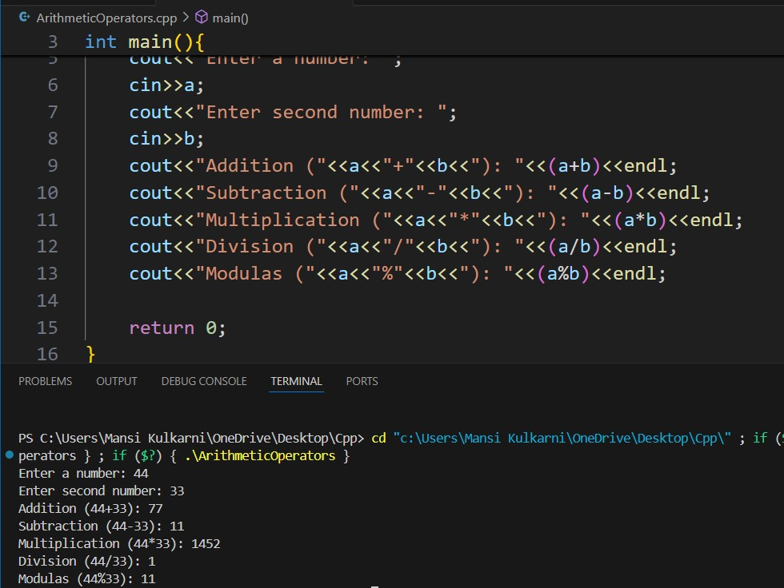
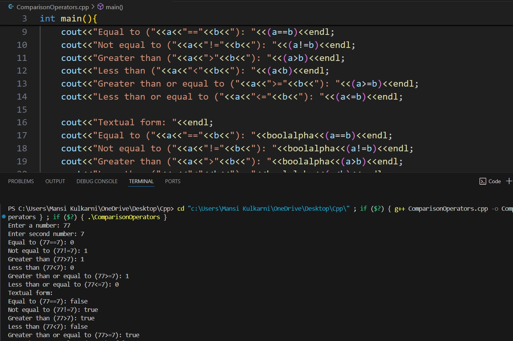
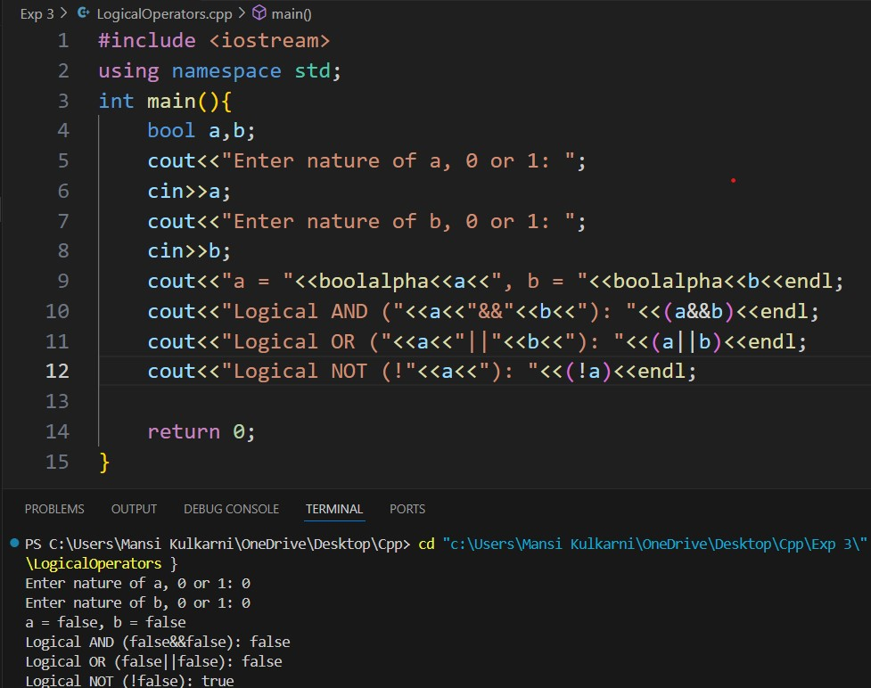

# Experiment 3
## Program 1
### Aim: 
Take two numbers as input from user and perform arithmetic operations on those numbers
### Software used: 
Visual Studio Code
### Theory:
Arithmetic Operators: Perform basic mathematical operations like addition (+), subtraction (-), multiplication (*), division (/), and modulus (%).
### Output:

### Conclusion:
We learned how to use arithmetic operators in C++.  

## Program 2
### Aim: 
Take two numbers as input from user and perform comparison operations on those numbers. 
### Software used: 
Visual Studio Code
### Theory:
Relational Operators: Compare two values and return a boolean result. Examples include == (equal to), != (not equal to), < (less than), > (greater than), <= (less than or equal to), >= (greater than or equal to).
### Output:

### Conclusion:
We learned how to use comparison operators in C++.

## Program 3
### Aim: 
Take two numbers as input from user and perform logical operations on those numbers
### Software used: 
Visual Studio Code
### Theory:
Logical Operators: Perform logical operations and return a boolean result. These include && (logical AND), || (logical OR), and ! (logical NOT).
### Output:

### Conclusion:
We learned how to use logical operators in C++.
